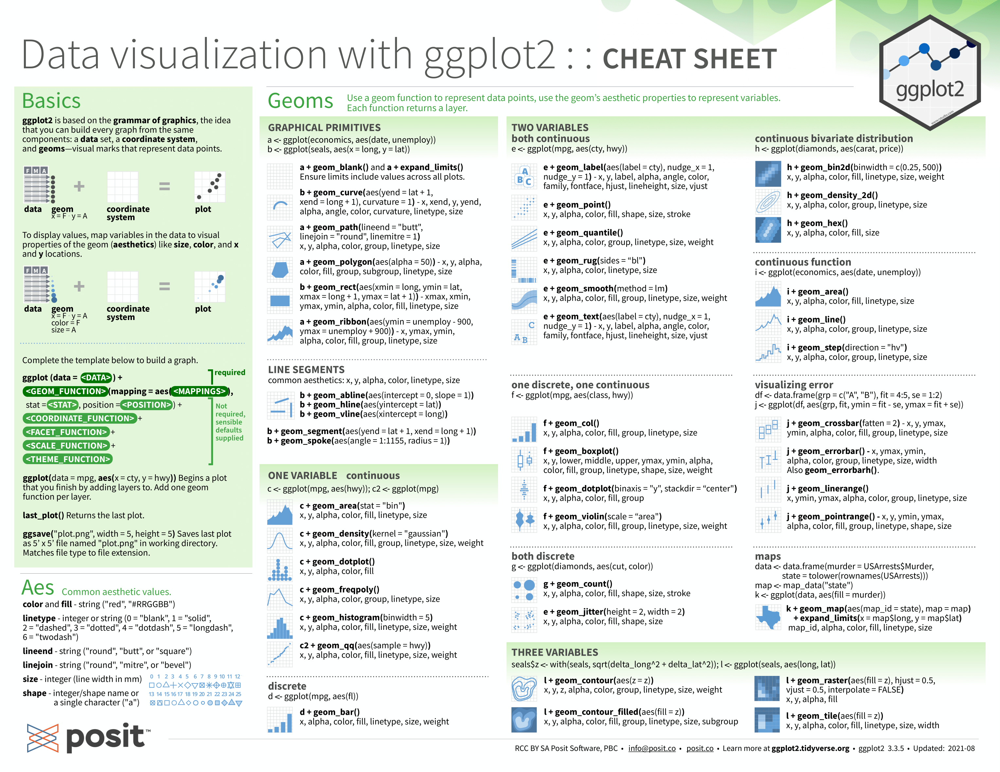
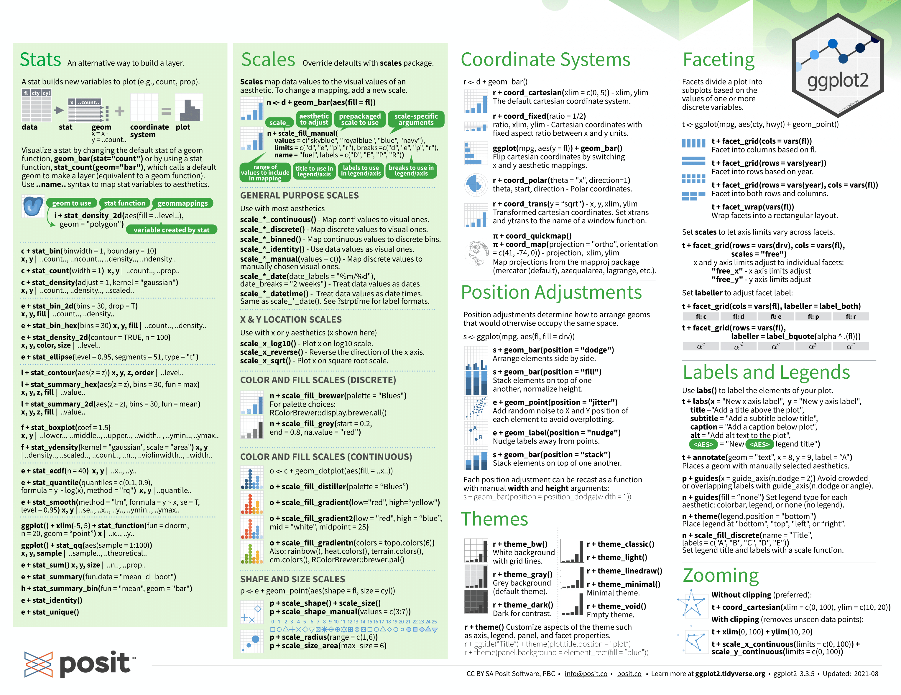

## Grammar of graphics
- single framework that easily generalises to larger sets of variables with complex hierarchies
- framework for a huge variety of graphics
- agile exploration of data and creation of coherent graphics


```{r setup, include=FALSE, warning=FALSE}
knitr::opts_chunk$set(echo = TRUE, warning = FALSE, message=FALSE)
library(tidyverse)
```

---

## Popular GG package in R and Python

```{r, echo = FALSE, out.width = "400px",include=T,fig.align="center"} 
  knitr::include_graphics("figures/ggplot2.jpg")
```

## What this course is not


## What is it then?

- personal view on why grammar of graphics dominates for most datasets
- attempt to entice people to find out more for themselves

## Why don't more people use it?

In my experience, people:

- lack exposure to it
- find the syntax confusing and "overly complex"
- don't see the benefits over "traditional" data plotting
- are busy

## Course structure

- short lectures
- problem set: answers in R and Python (see Github link)

## Suicide rates: 1985 to 2016
```{r, echo = FALSE, warning=FALSE, message=FALSE}
library(kableExtra)
df <- read.csv("data/master.csv") %>% 
  mutate(age=fct_relevel(age,
                         "5-14 years",
                         "15-24 years",
                         "25-34 years",
                         "35-54 years",
                         "55-74 years",
                         "75+ years"))
df_sum <- df %>% 
  group_by(country) %>% 
  summarise(suicides.100k.pop=mean(suicides.100k.pop)) %>% 
  arrange(suicides.100k.pop) %>% 
  filter(suicides.100k.pop > 0)
df_sum <- df_sum[c(10:10, 40:41, 98:99), ]
countries <- df_sum$country
df <- df %>% 
  filter(country %in% countries) %>% 
  select(country, year, age, sex, suicides_no, population)
# df <- df %>% 
#   select(country, year, age, suicides_no, population)
kable(df[1:100, ],format="html",escape = F, col.names = colnames(df)) %>% 
  kable_styling() %>%
  kableExtra::scroll_box(width = "100%", height = "400px")
```

# Comparing traditional and GG way
## Standard way
```{r, out.width = "560px"}
plot(df$population, df$suicides_no)
```


## Plotting with ggplot / plotnine
```{r, out.width = "560px"}
ggplot(df, aes(x=population, y=suicides_no)) +
  geom_point()
```

## How to colour points according to sex?

## Sex the traditional way (uses "wide" format)
```{r, echo = FALSE, warning=FALSE, message=FALSE}
df_wide <- df %>% 
  select(country, year, age, sex, suicides_no, population) %>% 
  pivot_wider(values_from = c("population", "suicides_no"),
              names_from = "sex",
              id_cols = c("country", "year", "age"))
kable(df_wide[1:100, ],format="html",
      escape = F, col.names = colnames(df_wide)) %>% 
  kable_styling(font_size=16) %>%
  kableExtra::scroll_box(width = "100%", height = "400px")
```

## Traditional: plot data separately for each subpopulation
```{r, out.width = "560px"}
plot(df_wide$population_male, df_wide$suicides_no_male, col="red")
points(df_wide$population_female, df_wide$suicides_no_female, col="blue")
```

## GG way uses long format
```{r, echo = FALSE, warning=FALSE, message=FALSE, out.width = "560px"}
kable(df[1:100, ],format="html",escape = F, col.names = colnames(df)) %>% 
  kable_styling() %>%
  kableExtra::scroll_box(width = "100%", height = "400px")
```

## GG: associate extra aesthetic ("colour") to data points
```{r, out.width = "560px"}
ggplot(df, aes(x=population, y=suicides_no, colour=sex)) +
  geom_point()
```

# Aesthetics and geoms
## Plots operate on aesthetic mappings
`aes(x=population, y=suicides_no, colour=sex)`

- is an example of an aesthetic mapping: it associates aesthetics with values for each of your data points
- here it associates:
    - the horizontal position of data points with population
    - the vertical with suicides count
    - the colour of points with sex
- many other aesthetics, such as shape and size, are possible
- geoms (see later) control how aesthetics are displayed

## Colour by country: traditionally annoying
```{r, out.width = "560px"}
ggplot(df, aes(x=population, y=suicides_no, colour=country)) +
  geom_point()
```

## Shape by country: traditionally annoying
```{r, out.width = "560px"}
ggplot(df, aes(x=population, y=suicides_no, shape=country)) +
  geom_point()
```

## Regressions by country
```{r, out.width = "560px"}
ggplot(df, aes(x=population, y=suicides_no, colour=country)) +
  geom_point(alpha=0.3) + geom_smooth(method="lm", se=F)
```

## Overall regression
```{r, out.width = "560px", warning=FALSE, message=FALSE}
ggplot(df, aes(x=population, y=suicides_no)) +
  geom_point(alpha=0.3, aes(colour=country)) +
  geom_smooth(method="lm", se=F, colour="black")
```

## What is a geom?

- `geom_point` and `geom_smooth` are both geometrical elements ("geoms") used to represent data
- here they both take the same x and y variable and use it to produce a different visualisation
- other geom examples are `geom_line`, `geom_histogram`, `geom_violin`, `geom_rectangle`

## Simple geom example
```{r, echo = FALSE, warning=FALSE, message=FALSE}
data_df <- data.frame(
  x = c(1, 2, 3), 
  y = c(2, 4, 10), 
  label = c("a","b","c")
)
kable(data_df,format="html",
      escape = F, col.names = colnames(data_df)) %>% 
  kable_styling() %>%
  kableExtra::scroll_box(width = "100%", height = "400px")
```
## point
```{r, out.width = "560px"}
ggplot(data_df, aes(x, y, label = label)) +
  theme(text=element_text(size=14)) +
  geom_point()
```

## text
```{r, out.width = "560px"}
ggplot(data_df, aes(x, y, label = label)) +
  theme(text=element_text(size=14)) +
  geom_text(size=18)
```

## col
```{r, out.width = "560px"}
ggplot(data_df, aes(x, y, label = label)) +
  theme(text=element_text(size=14)) +
  geom_col()
```

## line
```{r, out.width = "560px"}
ggplot(data_df, aes(x, y, label = label)) +
  theme(text=element_text(size=14)) +
  geom_line()
```

## line and points
```{r, out.width = "560px"}
ggplot(data_df, aes(x, y, label = label)) +
  theme(text=element_text(size=14)) +
  geom_line() + geom_point()
```

## line and jittered points
```{r, out.width = "560px"}
ggplot(data_df, aes(x, y, label = label)) +
  theme(text=element_text(size=14)) +
  geom_line() + geom_jitter()
```

## regression line and jitter
```{r, out.width = "560px"}
ggplot(data_df, aes(x, y, label = label)) +
  theme(text=element_text(size=14)) +
  geom_smooth(method="lm", se=F, formula = y~x) + geom_jitter()
```

## polygon
```{r, out.width = "560px"}
ggplot(data_df, aes(x, y, label = label)) +
  theme(text=element_text(size=14)) +
  geom_polygon()
```

## Order of layering
```{r, out.width = "560px"}
ggplot(df, aes(x=population, y=suicides_no)) +
  geom_point(alpha=1, aes(colour=country)) +
  geom_smooth(method="lm", se=F, colour="black")
```

## Order of layering
```{r, out.width = "560px"}
ggplot(df, aes(x=population, y=suicides_no)) +
  geom_smooth(method="lm", se=F, colour="black") +
  geom_point(alpha=1, aes(colour=country))
```

## Change axis scales
```{r, out.width = "560px"}
ggplot(df, aes(x=population, y=suicides_no)) +
  geom_point(alpha=0.3, aes(colour=country)) +
  scale_x_sqrt() + scale_y_sqrt()
```

# What has happened to suicide trends over time?

## Overall trends over time
```{r, out.width = "560px"}
ggplot(df, aes(x=year, y=suicides_no)) +
  geom_point(alpha=0.3)
```

## Boxplots
```{r, out.width = "560px"}
ggplot(df, aes(x=as.factor(year), y=suicides_no)) +
  geom_boxplot()
```

## Boxplots flipped
```{r, out.width = "560px"}
ggplot(df, aes(x=as.factor(year), y=suicides_no)) +
  geom_boxplot() +
  coord_flip()
```

## Trends by country
```{r, out.width = "560px"}
ggplot(df, aes(x=as.factor(year), y=suicides_no, fill=country)) +
  geom_boxplot() + 
  coord_flip()
```

## Separate by age group
```{r, out.width = "560px"}
ggplot(df, aes(x=year, y=suicides_no, colour=country, shape=age)) +
  geom_point(alpha=0.8)
```

## Facet panelling
- one way to add variables is with aesthetics
- another way, especially useful for categorical variables, is to split plots into facets
- each facet represents a plot of a subset of your data

## Facet by country
```{r, out.width = "560px"}
ggplot(df, aes(x=year, y=suicides_no, shape=age)) +
  geom_point() + facet_wrap(~country)
```

## Age and country panels
```{r, out.width = "560px"}
ggplot(df, aes(x=year, y=suicides_no)) +
  geom_point() + facet_grid(vars(country), vars(age), scales="free")
```

## Add in sex
```{r, out.width = "560px"}
ggplot(df, aes(x=year, y=suicides_no, colour=sex)) +
  geom_point() + facet_grid(vars(country), vars(age), scales="free")
```

## Change geom to line
```{r, out.width = "550px"}
ggplot(df, aes(x=year, y=suicides_no, colour=sex)) +
  geom_line() + facet_grid(vars(country), vars(age), scales="free")
```

## Adding linear regressions
```{r, out.width = "550px"}
ggplot(df, aes(x=year, y=suicides_no, colour=sex)) +
  geom_line() + facet_grid(vars(country), vars(age), scales="free") +
  geom_smooth(method="lm", se=F)
```

# Conclusions
## Benefits of GG

- agile data exploration: keep tinkering till it looks right
- aesthetics allow layering of hierarchies of features
- geoms handle a lot so less to get wrong
- dominates traditional graphics for rich datasets

## Packages

- R: ggplot2
- Python: plotnine (essentially ggplot2) and Plotly

## Where to learn more


## Cheatsheet 1

```{r, echo = FALSE, warning=FALSE, message=FALSE, out.width = "700px"}

```

## Cheatsheet 2

```{r, echo = FALSE, warning=FALSE, message=FALSE, out.width = "700px"}

```